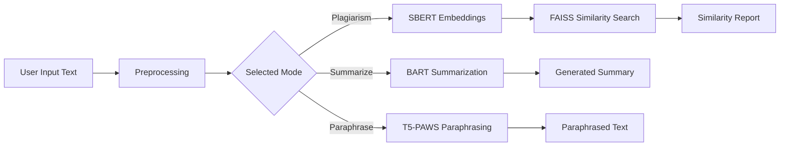

<div align="center">

# 📄 DocTrust

### Integrated Academic Writing Assistance System

**Summarize smarter. Paraphrase safely. Detect semantic plagiarism.**


</div>

---

## 🌟 Overview

**DocTrust** is an AI-powered academic writing assistant that combines three essential Natural Language Processing modules into one unified platform:

| Module | Model | Purpose |
|---|---|---|
| 📝 Text Summarization | `facebook/bart-large-cnn` | Generate concise abstractive summaries from long text |
| ✍️ Text Paraphrasing | `Vamsi/T5_Paraphrase_Paws` | Rewrite text while preserving its original meaning |
| 🔍 Plagiarism Detection | `all-MiniLM-L6-v2` + FAISS | Detect semantic similarity against a reference corpus |

DocTrust was built to help **students, researchers, and professionals** save time, improve writing quality, and verify originality through a simple Streamlit web interface.

---

## 🚀 Why DocTrust?

Many existing tools solve only one writing problem at a time. Users often need separate platforms for summarization, paraphrasing, and plagiarism detection. DocTrust brings all three into one free, open-source workflow.

| Capability | Grammarly | QuillBot | Turnitin | DocTrust |
|---|---:|---:|---:|---:|
| Text Summarization | ❌ | ❌ | ❌ | ✅ |
| Paraphrasing | Limited | ✅ | ❌ | ✅ |
| Plagiarism Detection | ❌ | ❌ | ✅ | ✅ |
| Semantic AI Models | ❌ | Partial | ❌ | ✅ |
| Free & Open Source | ❌ | ❌ | ❌ | ✅ |
| All-in-One Workflow | ❌ | ❌ | ❌ | ✅ |

---

## ✨ Key Features

### 📝 Abstractive Summarization

DocTrust uses **BART**, a Transformer encoder-decoder model fine-tuned on the CNN/DailyMail dataset. Instead of simply extracting sentences, it generates fluent summaries that capture the main meaning of the input.

**Generation strategy:**

- Beam search decoding
- Default `num_beams=4`
- Balanced summary quality and speed
- Input preprocessing and truncation to avoid model token-limit issues

### ✍️ Context-Aware Paraphrasing

DocTrust uses a T5 model fine-tuned on PAWS to produce paraphrases that preserve the original meaning while changing the wording.

**Important fix implemented:**

The project solves the common `Similarity = 1.0` copying problem by avoiding the conflict between `num_beams > 1` and `do_sample=True`. The final paraphrasing strategy uses pure sampling:

- `num_beams=1`
- `do_sample=True`
- `temperature=1.5`
- `top_k=120`
- `top_p=0.95`
- `num_return_sequences=3`

The system generates multiple candidate paraphrases, compares them using SBERT cosine similarity, and returns the most suitable candidate.

### 🔍 Semantic Plagiarism Detection

DocTrust uses **Sentence-BERT** embeddings and **FAISS** similarity search to detect meaning-level overlap, not only exact word matching. This allows the system to catch paraphrased plagiarism that traditional TF-IDF or string-matching systems may miss.

| Similarity Score | Interpretation |
|---:|---|
| `0.95 – 1.00` | Near-identical / direct copy |
| `0.80 – 0.95` | High similarity — likely plagiarism |
| `0.60 – 0.80` | Moderate similarity — review needed |
| `< 0.60` | Low similarity — likely original |

---

## 🧠 System Architecture



### Preprocessing Pipeline

Before any text reaches the models, DocTrust applies a lightweight preprocessing stage:

1. Removes repeated spaces and newlines.
2. Truncates long input to approximately 1,500 characters.
3. Adds the T5 task prefix for paraphrasing.
4. Tokenizes input using Hugging Face tokenizers.
5. Encodes text into 384-dimensional SBERT vectors for semantic comparison.

---

## 📊 Experimental Results

The current notebook uses a small demonstration setup for fast testing. Results are based on sample-level evaluation and should be expanded in future work.

| Evaluation Area | Metric | Result |
|---|---:|---:|
| Summarization | Average ROUGE-1 F1 | `0.498` |
| Paraphrasing | Average Cosine Similarity | `0.826` |
| Plagiarism Detection | Demo Case Detection | Direct copy, paraphrased text, and original text correctly separated |

### Interpretation

- A ROUGE-1 score around `0.50` indicates strong keyword and content retention in generated summaries.
- A paraphrase similarity score around `0.83` falls in the ideal range where meaning is preserved while wording is changed.
- Semantic plagiarism detection successfully identifies both direct copying and paraphrased similarity in the demo corpus.

---

## 🖼️ Application Preview

Add your project screenshots here after deployment:

```text
assets/homepage.png
assets/summarization-demo.png
assets/paraphrasing-demo.png
assets/plagiarism-demo.png
```

Recommended README image layout:

| Home Interface | Plagiarism Results |
|---|---|
| `assets/homepage.png` | `assets/plagiarism-demo.png` |

---

## 🛠️ Tech Stack

| Category | Tools |
|---|---|
| Programming Language | Python |
| Web Framework | Streamlit |
| NLP Models | BART, T5, SBERT |
| Model Library | Hugging Face Transformers |
| Embeddings | Sentence-Transformers |
| Vector Search | FAISS |
| Dataset | CNN/DailyMail 3.0.0 |
| Evaluation | ROUGE, Cosine Similarity |
| Deployment Testing | Google Colab, ngrok |

---

## 📁 Project Structure

```text
DocTrust/
├── app.py
├── pipeline.py
├── evaluation_utils.py
├── requirements.txt
├── DocTrust_Project.ipynb
├── README.md
└── assets/
```

### Main Files

| File | Description |
|---|---|
| `app.py` | Streamlit web application |
| `pipeline.py` | Core NLP pipeline for summarization, paraphrasing, and plagiarism detection |
| `evaluation_utils.py` | Visualization helpers for module scores |
| `requirements.txt` | Required Python dependencies |
| `DocTrust_Project.ipynb` | Full notebook implementation and experiments |

---

## ⚙️ Installation

### 1. Clone the Repository

```bash
git clone https://github.com/your-username/DocTrust.git
cd DocTrust
```

### 2. Create a Virtual Environment

```bash
python -m venv venv
```

### 3. Activate the Environment

**Windows:**

```bash
venv\Scripts\activate
```

**macOS / Linux:**

```bash
source venv/bin/activate
```

### 4. Install Dependencies

```bash
pip install -r requirements.txt
```

---

## 📦 Requirements

```txt
transformers==4.41.2
sentence-transformers==2.7.0
datasets
rouge-score
faiss-cpu
scikit-learn
streamlit
matplotlib
torch
sentencepiece
```

---

## ▶️ Run the Streamlit App

```bash
streamlit run app.py
```

Then open the local URL shown in the terminal.

Usually it will be:

```text
http://localhost:8501
```

---

## 🌐 Optional Public Deployment with ngrok

For a temporary public demo, you can expose the Streamlit app using ngrok.

```bash
pip install pyngrok
```

```python
from pyngrok import ngrok

public_url = ngrok.connect(8501)
print(public_url)
```

Do not commit API keys, tokens, or ngrok authtokens to GitHub. Store them as environment variables or repository secrets.

---

## 🧪 Usage Examples

### Summarization

```python
from pipeline import process_text

text = "Artificial intelligence is transforming education by helping students learn faster and giving teachers better tools."
result = process_text(text, "summarize")
print(result)
```

### Paraphrasing

```python
from pipeline import process_text

text = "Natural language processing allows machines to understand and generate human language."
result = process_text(text, "paraphrase")
print(result)
```

### Plagiarism Detection

```python
from pipeline import process_text

text = "AI improves healthcare systems by supporting diagnosis and treatment planning."
result = process_text(text, "plagiarism")
print(result)
```

---

## 🧩 Core Pipeline Logic

DocTrust uses one unified router function:

```python
def process_text(text, mode):
    text = preprocess_text(text)

    if mode == "summarize":
        return summarize(text)

    if mode == "paraphrase":
        return paraphrase(text)

    if mode == "plagiarism":
        return check_plagiarism(text)

    return "Invalid mode"
```

This makes the system modular, clean, and easy to extend.

---

## ✅ What Makes This Project Strong?

- Combines three valuable writing tools in one interface.
- Uses modern Transformer-based NLP models.
- Detects semantic similarity, not only exact text copying.
- Includes an end-to-end working Streamlit application.
- Uses evaluation metrics to measure performance.
- Includes a clear future roadmap for scaling the project.

---

## ⚠️ Current Limitations

- English-only support.
- Demo plagiarism corpus is small.
- Very long documents are truncated before processing.
- The system does not search the full internet for plagiarism.
- GPU acceleration is recommended for faster production use.
- ngrok links are temporary and expire unless configured with a persistent setup.

---

## 🛣️ Future Work

- Add Arabic language support.
- Expand plagiarism corpus coverage.
- Fine-tune summarization models on academic papers.
- Add user accounts and document history.
- Improve handling of long documents through chunking.
- Deploy permanently on AWS, GCP, Azure, or Streamlit Community Cloud.
- Add PDF/DOCX upload support.
- Add downloadable reports for plagiarism results.

---

## 👥 Team

| Name | Role |
|---|---|
| Omar Essam | Team Leader |
| Ahmed Khaled | Team Member |
| Sara Mohamed | Team Member |
| Seif Tarek | Team Member |
| Abdelrahman Khaled | Team Member |
| Mohamed Mahmoud | Team Member |
| Nesma Mohamed | Team Member |

**Supervised by:** Dr. Haithem Ghallab  
**Year:** 2026

---

## 🎓 Academic Integrity Note

DocTrust is designed as an academic writing support tool. It helps users understand, rewrite, and evaluate text, but it does not replace human judgment. Plagiarism results should be reviewed carefully, especially in formal academic or institutional contexts.

---

## ⭐ Suggested GitHub Improvements

To make the repository more professional, consider adding:

- `LICENSE`
- `assets/` folder with screenshots
- `demo.gif`
- `docs/` folder for the project report and presentation
- `sample_inputs/` folder for test examples
- GitHub repository description: `Integrated NLP system for summarization, paraphrasing, and semantic plagiarism detection.`

---

<div align="center">

## 📄 DocTrust

**A unified AI writing assistant for better academic productivity and originality.**

</div>
